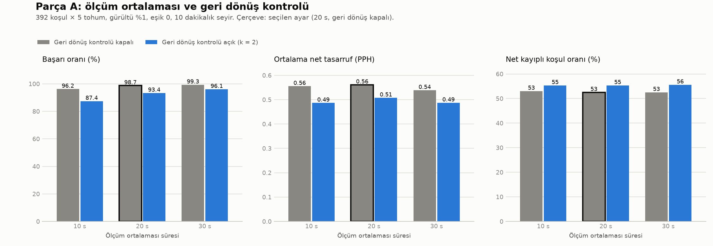
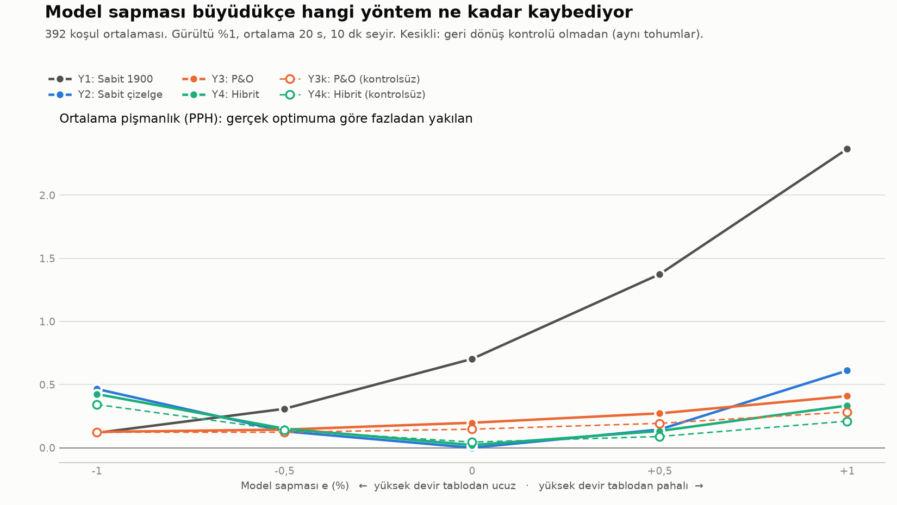
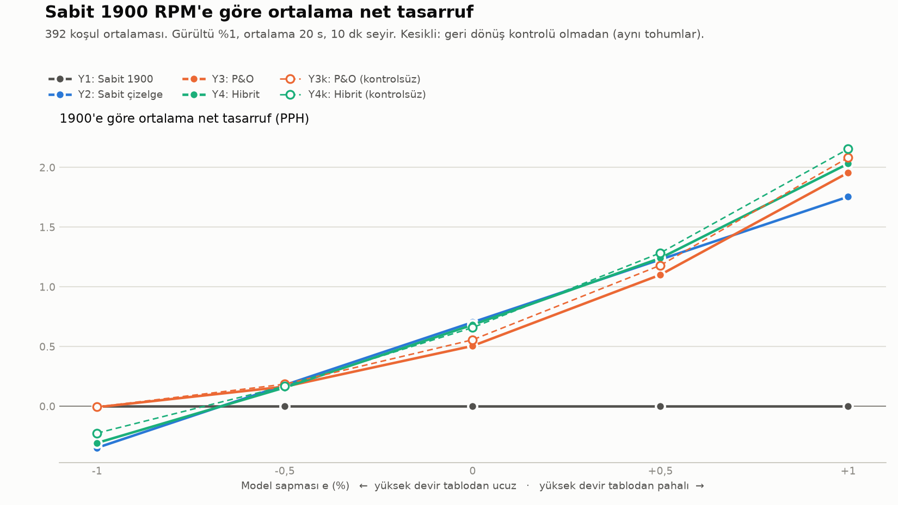
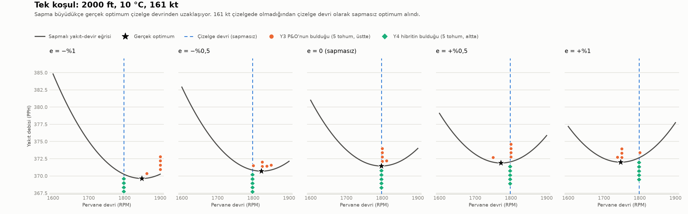

# Adım 7: Model hatasına dayanıklılık

Bu rapor iki deneyi özetler. **Parça A**'da mevcut test dünyasında ölçüm ortalaması süresi ve yeni bir
"geri dönüş kontrolü" denendi. **Parça B**'de, tezin ana deneyi olarak, uçağın POH tablosundan farklı
davrandığı "sapmalı dünyada" tablodan çıkarılmış sabit çizelge ile P&O algoritması karşılaştırıldı.
Kod: `analiz/adim7.py`, `sapmali_ucak.py`, `stratejiler.py`. Çıktılar: `sonuclar/adim7*`.

## Kısa cevap

- **Model doğruysa sabit çizelge en iyisi, ama model hatasına dayanıksız.** Sapma yokken (e = 0)
  çizelgenin pişmanlığı sıfır. Sapma büyüdükçe pişmanlık hızla artıyor: e = +%1'de 0,61 PPH. e = −%1'de
  ise 0,47 PPH ile sabit 1900 RPM'den bile kötü (0,12 PPH); bu sapmada koşulların %49'unda 1900'e göre
  net kayıp veriyor.
- **P&O (Y3) en dayanıklı tanımlı yöntem.** Pişmanlığı bütün sapmalarda 0,13–0,41 PPH arasında kalıyor.
  En kötü durumu (0,41 PPH), çizelgenin (0,61) ve hibritin (0,43) en kötü durumundan iyi. Bedeli,
  sapma küçükken çizelgeden daha fazla yakması: e = 0'da 0,20 PPH.
- **Hibrit (Y4) beklenenden zayıf.** Sapma küçükken çizelgeye çok yakın (e = 0'da 0,02 PPH) ve e > 0'da
  tanımlı yöntemlerin en iyisi. Ama e = −%1'de neredeyse çizelge kadar kötü (0,43 PPH). e = 0 ve
  e = −%0,5'te ise çizelgeden kötü. Nedeni, koşuların %90–100'ünde çizelge devrinde kalması.
- **Geri dönüş kontrolü beklendiği gibi çalışmadı.** Parça A'da ortalama net tasarrufu düşürdü
  (20 s'de 0,56 → 0,51 PPH) ve net kayıplı koşul oranını azaltmak yerine artırdı (%53 → %55). Tek
  faydası en kötü koşudaki kaybı küçültmesi oldu (10 s'de −1,38 → −0,22 PPH). Parça B'de de kontrolsüz
  sürümler neredeyse her sapmada daha az pişmanlık verdi.
- **Bu deneyde en dayanıklı yöntem kontrolsüz P&O.** En kötü ortalama pişmanlığı 0,28 PPH. Beş sapma
  üzerinden ortalamada ise kontrolsüz hibrit (0,165 PPH) ve kontrolsüz P&O (0,174 PPH) en iyileri.
- Bütün farklar mutlak olarak küçük: PPH'nin onda biri mertebesinde, 1900 RPM yakıtının %0,05–0,7'si.
  Tez için asıl bulgu büyüklükten çok biçim: çizelgenin pişmanlığı model hatasıyla büyüyor, P&O'nunki
  sınırlı kalıyor.

## Varsayımlar

| Varsayım | Değer | Not |
|---|---|---|
| Motor zaman sabiti (tau) | 2 s | Gerçek motor verisi yok |
| Bekleme | 3·tau = 6 s | Her yeni devirde |
| Sensör gürültüsü | %1 (std, gerçek değerin yüzdesi) | Beyaz Gauss, örnekler bağımsız (iyimser) |
| Örnekleme | 10 Hz | |
| Seyir süresi | 10 dakika | |
| Geri dönüş kontrolü eşiği | esik = k·√2·(gürültü oranı × yakıt)/√(örnek sayısı), k = 2 | Kontrolör gürültü düzeyini biliyor varsayıldı |
| Sapmalı dünya | yakıt × (1 + e·(devir − 1750)/150), tork değişmez | **Fiziksel bir model değil**, model hatası için duyarlılık analizi |

Sapmalı dünyada e > 0 iken yüksek devir tablodakinden pahalı, bu yüzden optimum aşağı kayar. e < 0 iken
tersi olur. 1750 RPM'de yakıt değişmez; 1600 ve 1900 RPM'de ±e oranında değişir. Aynı e bütün zarfa
uygulandı.

**Geri dönüş kontrolü** (`stratejiler.geri_donus_kontrolu`): P&O bittikten sonra referans devir
(normalde başlangıç devri) ve bulunan devir, aynı ortalama süresiyle yeniden ölçülür. Bulunan devir
referanstan en az eşik kadar düşük ölçülmezse referansa geri dönülür. Yeniden ölçümlerin süresi ve
yakıtı arama maliyetine dahil. %1 gürültü, 20 s ortalama (200 örnek) ve ortalama 324 PPH yakıtla
eşik yaklaşık **0,65 PPH**.

## Parça A sonuçları: mevcut dünyada iyileştirme

Kurulum: 392 koşul × 5 tohum, gürültü %1, eşik 0, başlangıç 1900 RPM. Tohumlar Adım 6 Deney B ile aynı.
Kontrol: "10 s, kapalı" ayarı Adım 6 sonuçlarını birebir verdi (bulunan devirler aynı, net tasarruf
farkı yalnızca CSV yuvarlaması kadar, < 0,0001 PPH). Net değerler koşul ortalamaları üzerinden
hesaplandı.

| Ortalama (s) | Geri dönüş | Başarı | Net ort. (PPH) | Net medyan (PPH) | Net kayıplı koşul | En kötü koşul (PPH) | En kötü koşu (PPH) | Arama (s) | Geri dönülen |
|---:|---|---:|---:|---:|---:|---:|---:|---:|---:|
| 10 | kapalı | %96,2 | 0,555 | −0,019 | %53,1 | −0,350 | −1,382 | 70 | – |
| 10 | açık | %87,4 | 0,487 | −0,013 | %55,4 | −0,143 | −0,221 | 89 | %37 |
| **20** | **kapalı** | **%98,7** | **0,561** | −0,023 | %52,6 | −0,250 | −0,638 | 119 | – |
| 20 | açık | %93,4 | 0,508 | −0,019 | %55,4 | −0,232 | −0,232 | 149 | %29 |
| 30 | kapalı | %99,3 | 0,539 | −0,022 | %52,6 | −0,322 | −0,678 | 166 | – |
| 30 | açık | %96,1 | 0,487 | −0,021 | %55,6 | −0,322 | −0,322 | 207 | %25 |

**Bulgular**

- **Ortalama süresini 10 s'den 20 s'ye çıkarmak** başarıyı %96,2'den %98,7'ye çıkarıyor, ortalama net
  tasarrufu ise hafifçe artırıyor. 30 s'de başarı biraz daha artıyor ama arama uzadığı için net
  tasarruf düşüyor.
- **Geri dönüş kontrolü her ortalama süresinde başarıyı ve ortalama net tasarrufu düşürüyor.** Net
  kayıplı koşul oranını da azaltmıyor, tersine 2–3 puan artırıyor. Nedenleri:
  - Optimumu 1900'de olan koşullarda kontrolün iki ek ölçümü, önlediği yanlış devir kaybı kadar yakıt
    harcıyor.
  - Gerçek ama küçük kazançlar (bulunan devirle 1900 arasındaki fark eşiğin altında kalanlar) yanlışlıkla
    1900'e geri götürülüyor. Koşuların %25–37'sinde geri dönülüyor.
- **Kontrolün tek faydası en kötü durumu sınırlaması.** En kötü tek koşu kaybı 10 s'de −1,38'den
  −0,22 PPH'ye iniyor.

**Seçim ve gerekçesi:** Adım 6'daki ölçüt kullanıldı: başarı oranı en yükseğe en fazla 5 puan yakın
olan ayarlar arasından ortalama net tasarrufu en büyük olan. Seçilen ayar **20 s ortalama, geri dönüş
kapalı**. Başarısı %98,7; en yüksek başarıdan (%99,3) 0,6 puan geride, ortalama net tasarrufu ise en
yüksek (0,561 PPH).

**Parça B ile çelişki:** Görev tanımında Y3 ve Y4 "geri dönüş kontrolünü uygula" diye tanımlanmıştı,
oysa Parça A'nın en iyi ayarında kontrol kapalı. Parça B'de iki seçenek de çalıştırıldı:

- **Y3 ve Y4** tanımlandığı gibi, kontrolle.
- **Y3k ve Y4k** Parça A'nın en iyi ayarıyla, kontrolsüz.

Dördünde de ortalama süresi 20 s ve tohumlar aynı. Böylece kontrolün etkisi ayrıca görülebiliyor.

## Parça B sonuçları: sapmalı dünya

**Yöntemler** (10 dakikalık seyir, %1 gürültü, 20 s ortalama; Y3/Y4 5 tohum):

| Kod | Yöntem | Açıklama |
|---|---|---|
| Y1 | Sabit 1900 | Arama yok, 10 dakika 1900 RPM |
| Y2 | Sabit çizelge | Arama yok, 10 dakika `sabit_cizelge.csv`'deki devirde (sapmasız tablodan) |
| Y3 | P&O | 1900'den 50 RPM adımla P&O + geri dönüş kontrolü (referans 1900) |
| Y4 | Hibrit | Çizelge devrinden 25 RPM adımla P&O + geri dönüş kontrolü (referans çizelge devri) |
| Y3k | P&O (kontrolsüz) | Y3, geri dönüş kontrolü olmadan |
| Y4k | Hibrit (kontrolsüz) | Y4, geri dönüş kontrolü olmadan |

Y1 ve Y2 gerçek yakıttan doğrudan hesaplandı; 1900'den çizelge devrine geçiş ihmal edildi. Y4 de aynı
varsayımla çizelge devrinde kararlı seyirden başlıyor.

**Pişmanlık:** 10 dakikada yakılan yakıt eksi aynı süreyi o dünyadaki gerçek optimumda (1'er RPM
taramayla bulunan) geçirmenin yakıtı. PPH karşılığı olarak verildi. Ana ölçüt bu.

### Optimum devrin kayması

| e | Ortalama kayma (RPM) | Optimumu 1900'de olan koşul | Optimumu 1600'de olan koşul |
|---:|---:|---:|---:|
| −%1 | +36,1 | %76 | %0 |
| −%0,5 | +22,3 | %59 | %0 |
| 0 | 0 | %45 | %1 |
| +%0,5 | −26,8 | %31 | %4 |
| +%1 | −58,4 | %19 | %5 |

Kayma asimetrik. Sapmasız dünyada da koşulların %45'inde optimum zaten 1900'de olduğu için, e < 0
optimumu çoğunlukla 1900 limitine dayıyor; ortalama kayma 36 RPM'de kalıyor. e > 0 ise optimumu zarfın
içine doğru, ortalama 58 RPM aşağı çekiyor.

### Ortalama pişmanlık (PPH)

| Yöntem | −%1 | −%0,5 | 0 | +%0,5 | +%1 | Ortalama | En kötü |
|---|---:|---:|---:|---:|---:|---:|---:|
| Y1 Sabit 1900 | **0,118** | 0,308 | 0,704 | 1,374 | 2,366 | 0,974 | 2,366 |
| Y2 Sabit çizelge | 0,465 | 0,130 | **0,000** | 0,145 | 0,611 | 0,270 | 0,611 |
| Y3 P&O | 0,126 | 0,144 | 0,198 | 0,273 | 0,409 | 0,230 | 0,409 |
| Y4 Hibrit | 0,425 | 0,151 | 0,022 | 0,133 | 0,334 | 0,213 | 0,425 |
| Y3k P&O (kontrolsüz) | 0,123 | **0,123** | 0,147 | 0,193 | 0,283 | 0,174 | **0,284** |
| Y4k Hibrit (kontrolsüz) | 0,343 | 0,139 | 0,045 | **0,089** | **0,211** | **0,165** | 0,343 |

"Ortalama" ve "En kötü" sütunları beş sapma üzerinden hesaplandı. Her sütunda en iyi değer kalın.

### 1900'e göre ortalama net tasarruf (PPH)

| Yöntem | −%1 | −%0,5 | 0 | +%0,5 | +%1 |
|---|---:|---:|---:|---:|---:|
| Y1 Sabit 1900 | 0 | 0 | 0 | 0 | 0 |
| Y2 Sabit çizelge | −0,347 | 0,178 | 0,704 | 1,229 | 1,755 |
| Y3 P&O | −0,008 | 0,165 | 0,506 | 1,101 | 1,957 |
| Y4 Hibrit | −0,307 | 0,157 | 0,682 | 1,241 | 2,032 |
| Y3k P&O (kontrolsüz) | −0,005 | 0,185 | 0,557 | 1,181 | 2,083 |
| Y4k Hibrit (kontrolsüz) | −0,225 | 0,169 | 0,659 | 1,285 | 2,155 |

Yüzde olarak e = +%1'de Y4k %0,64, Y3k %0,62, Y2 %0,52. e = −%1'de Y2 −%0,10, Y3 −%0,003.

### 1900'e göre net kayıplı koşul oranı

| Yöntem | −%1 | −%0,5 | 0 | +%0,5 | +%1 |
|---|---:|---:|---:|---:|---:|
| Y2 Sabit çizelge | %48,7 | %30,4 | %0 | %0 | %0 |
| Y3 P&O | %84,7 | %71,4 | %55,6 | %41,1 | %26,3 |
| Y4 Hibrit | %93,4 | %75,8 | %48,2 | %37,0 | %24,2 |
| Y3k P&O (kontrolsüz) | %82,9 | %68,6 | %52,6 | %38,5 | %25,0 |
| Y4k Hibrit (kontrolsüz) | %90,8 | %74,5 | %50,8 | %36,2 | %22,7 |

Bu ölçüt yanıltıcı olabilir:

- P&O e = −%1'de koşulların %85'inde kayıp veriyor, ama bütün koşulların ortalama net tasarrufu
  yalnızca −0,008 PPH. Kayıplar, optimumun 1900'de olduğu yerlerde aramanın küçük maliyetinden geliyor.
- Çizelgenin kayıpları daha seyrek ama büyük: e = −%1'de ortalama net tasarruf −0,35 PPH.

### Tek koşul: 2000 ft, 10 °C, 161 kt

161 kt çizelgede olmadığı için çizelge devri olarak bu hızdaki sapmasız optimum (1798 RPM) alındı.

| e | Gerçek optimum | Y3'ün bulduğu (5 tohum) | Y4'ün bulduğu (5 tohum) |
|---:|---:|---|---|
| −%1 | 1849 | 1900, 1862,5, 1900, 1900, 1900 | hep 1798 |
| −%0,5 | 1823 | 1800, 1825, 1837,5, 1825, 1850 | hep 1798 |
| 0 | 1798 | 1800, 1800, 1812,5, 1800, 1800 | hep 1798 |
| +%0,5 | 1772 | 1800, 1800, 1800, 1750, 1800 | hep 1798 |
| +%1 | 1747 | 1750, 1750, 1737,5, 1750, 1800 | hep 1798 |

Bu koşulda hibrit bütün sapmalarda ve bütün tohumlarda çizelge devrinde kalıyor. P&O ise gerçek
optimumun kaydığı yöne gidiyor. e = −%1'de çoğunlukla 1900'e kadar çıkıyor; bu taraftaki eğri çok düz
olduğu için bunun bedeli küçük.

## Yorum

1. **Çizelge ile P&O arasındaki seçim, model hatasının büyüklüğüne bağlı.**
   - |e| ≤ %0,5 iken çizelge P&O ile yarışabiliyor ya da ondan iyi.
   - |e| = %1'de P&O açıkça daha iyi: e = +%1'de 0,41'e karşı 0,61 PPH, e = −%1'de 0,13'e karşı
     0,47 PPH.
   - Koşul bazında P&O, e = −%1'de koşulların %53'ünde, e = +%1'de %61'inde çizelgeden daha az
     pişmanlık veriyor.
   - Tezin ana argümanı bu: çizelgenin pişmanlığı model hatasıyla büyüyor, P&O'nunki sınırlı kalıyor.
     Bu dayanıklılığın bedeli, model doğruyken yakılan yaklaşık 0,15–0,20 PPH.
2. **Sapmanın yönü önemli.**
   - e < 0'da optimum çoğunlukla 1900 limitine dayanıyor. Bu yüzden 1900'den başlayan yöntemler (Y1, Y3)
     avantajlı, çizelge ve hibrit dezavantajlı.
   - e > 0'da optimum zarfın içine kayıyor. Bu yüzden 1900'de kalmak çok pahalı, arama yapan bütün
     yöntemler kazanıyor.
3. **Hibritin zayıflığı tasarımından geliyor.** Hibrit çizelge devrinden 25 RPM'lik adımla başlıyor ve
   sonucu çizelge devrine karşı denetliyor. Çizelgeden 25–50 RPM uzaklaşmanın getirdiği kazanç
   çoğunlukla 0,65 PPH'lik eşiğin altında kalıyor. Bu yüzden kontrol neredeyse her zaman çizelgeye geri
   dönüyor (e = 0'da %100, e = −%1'de %90 çizelge devrinde biten koşu). Sonuçta hibrit, "arama maliyeti
   eklenmiş bir çizelge" gibi davranıyor. Kontrolsüz hibrit daha esnek, ama başlangıç adımı küçük
   olduğu için e = −%1'de 1900'e çoğu zaman yine de ulaşamıyor: koşuların %52'si 1900'de bitiyor,
   oysa optimumu 1900'de olan koşulların oranı %76.
4. **Geri dönüş kontrolünün eşiği, bu dünyadaki kazançlara göre fazla büyük.** Kontrol, ancak bulunan
   devir referanstan 0,65 PPH'den fazla iyi ölçülürse bulunan devri tutuyor. Oysa eğrilerin dibi düz
   olduğu için gerçek kazançların çoğu bundan küçük. Kontrol bu yüzden doğru kararları da geri
   alıyor. Daha küçük bir k ya da daha uzun yeniden ölçüm denenebilir, ama bu adımda parametrelerle
   oynanmadı.
5. **Önerilen sonraki adımlar (denenmedi):**
   - Kontrolsüz P&O'yu ana yöntem almak.
   - Hibritte başlangıç adımını büyütmek ya da ilk yönü 1900'e doğru seçmek.
   - Gerçekçi bir sapma için sapmayı zarf boyunca değişken yapmak.

## Sınırlamalar

- **Sapmalı dünya fiziksel bir model değil.** Yalnızca doğrusal bir "eğim" hatası temsil ediliyor ve
  aynı e bütün zarfa uygulanıyor. Gerçek model hataları eğrinin biçimini değiştirebilir ve koşula göre
  değişebilir. ±%1 aralığı da bir varsayım.
- tau, gürültü düzeyi ve beyaz gürültü varsayımı Adım 6'daki gibi. Gürültü ilişkiliyse (yavaş kayma
  gibi), uzun ortalamanın faydası burada görülenden az olur.
- Geri dönüş kontrolü gürültü düzeyini (%1) bildiğini varsayıyor.
- Y2 ve Y4'te 1900'den çizelge devrine geçiş ihmal edildi (tau = 2 s ile birkaç saniyelik bir geçiş).
- Ortalama süresi (20 s) sapmasız dünyada (Parça A) seçildi; sapmalı dünyada en iyi süre farklı olabilir.
- Hibritin tasarım seçimleri (25 RPM başlangıç adımı, ilk yön aşağı) görevde verildiği gibi kullanıldı,
  iyileştirilmedi.
- Zarf ortalamalarında her koşul eşit sayıldı; koşul başına 5 tohum var. Yöntemler arasındaki farkların
  bir kısmı (ör. e = −%0,5'teki 0,12–0,15 PPH'lik değerler) tohum gürültüsü mertebesinde olabilir.
  Aynı tohumların bütün yöntemlerde kullanılması (ortak rastgele sayılar) karşılaştırmayı daha
  güvenilir kılıyor.

## Yeniden üretim

- `python analiz/adim7.py`: Parça A ve B'yi çalıştırır; 4 çekirdekte yaklaşık 7 dakika sürer. Konsola
  özeti yazar ve `sonuclar/` klasörüne şunları kaydeder:
  - `adim7a_ayarlar.csv`: Parça A, ayar başına
  - `adim7b_sonuclar.csv`: Parça B, koşu başına; Y1/Y2 için tohum −1
  - `adim7b_ozet.csv`: Parça B, yöntem × sapma; optimum kayması sütunları dahil
  - Dört grafik
- `python analiz/adim6_ayristirma.py`: Adım 6 raporunun 5. bölümündeki ayrıştırma hesabı.
- `python -m pytest -m "not slow"`: hızlı testler, yaklaşık 20 s.
- `python -m pytest`: bütün testler, yaklaşık 3 dakika.
- Yeni testler:
  - `sapmali_dunya(0)` tabloyla birebir aynı.
  - Tork değişmiyor ve yakıt çarpanı doğru.
  - e > 0'da optimum aşağı, e < 0'da yukarı kayıyor (4 koşulda).
  - Gürültüsüz durumda ve optimum 1900'deyken geri dönüş kontrolü 1900'de bitiyor.
  - Gerçekten iyi bir devir tutuluyor.
  - Eşik formülü doğru ve yeniden ölçümlerin süresi zamana ekleniyor.
  - Aynı tohum birebir aynı sonucu veriyor.
