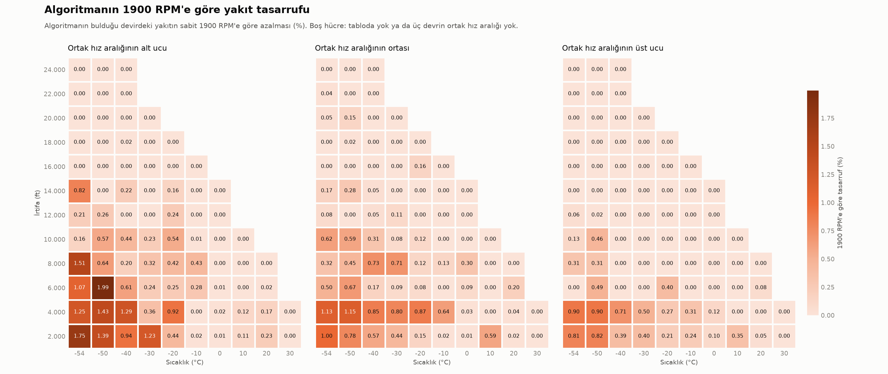
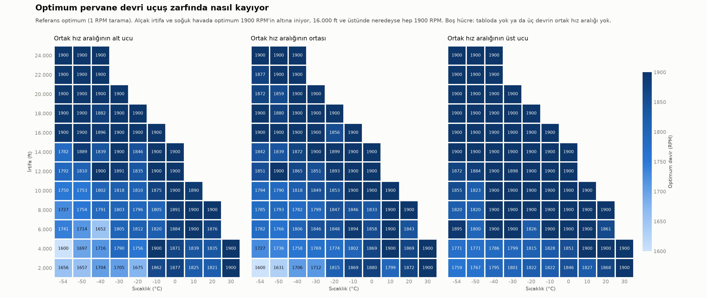

# Tüm uçuş zarfı sonuçlarının yorumu

Bu not, perturb & observe (P&O) algoritmasının Cessna 208B POH seyir tablosunun bütün uçuş
zarfında çalıştırılmasından (adım 5, `analiz/adim5.py`) çıkan sonuçların yorumudur.

**Kurulum:** Tablodaki 103 irtifa–sıcaklık kombinasyonunun 81'inde, üç devrin (1600/1750/1900 RPM)
ortak hız aralığında 5 kt arayla seçilen hızlarla toplam 392 koşul çözüldü. 22 kombinasyonda
ortak hız aralığı olmadığı için koşul atlandı. Algoritma 1900 RPM'den, 50 RPM adımla başladı; en
küçük adım 10 RPM. Referans optimum, devrin 1600–1900 arasında 1'er RPM taranmasıyla bulundu.
Tasarruf, sabit 1900 RPM'e göre hesaplandı.

**Kısaca:** Algoritma bu test dünyasında sorunsuz çalışıyor. Asıl bulgular algoritmayla ilgili
değil: (1) 1900 RPM'e göre kazanç küçük ve belli bölgelerde toplanıyor, (2) yakıt–devir eğrisinin
dibi çok düz; gürültü eklendiğinde asıl zorluk bu olacak, (3) bu test dünyasında P&O sabit
çizelgeden üstün olamaz.

---

## 1. Algoritma bu dünyada işini yapıyor

- 392 koşulun hepsinde algoritmanın bulduğu yakıt, referans en düşük yakıttan en fazla
  0,5 PPH fazla. En büyük fark **0,035 PPH**.
- Bulunan devir referanstan ortalama 2 RPM, en fazla 12 RPM uzakta.
- Ortalama **4,8 ölçüm**: optimum 1900'deyse 3, aradaysa 6,3.
- Gürültüsüz ve tek dipli bir eğride başka bir sonuç beklenmezdi. Bu sonuç algoritmanın doğru
  kurulduğunu gösteriyor, zorlandığı bir durumu değil.

## 2. Kazanç küçük ve belli bölgelerde

| 1900 RPM'e göre tasarruf | PPH  | %    |
|--------------------------|------|------|
| Ortalama                 | 0,70 | 0,21 |
| Medyan                   | 0,02 | 0,01 |
| En düşük                 | 0,00 | 0,00 |
| En yüksek                | 6,08 | 1,99 |

En yüksek tasarruf: 6000 ft, −50 °C, 144 kt (1900 → 1712,5 RPM).

- Koşulların **%48'inde tasarruf sıfır**, üçte ikisinde 0,5 PPH'nin altında.
- Toplam tasarrufun %80'i 392 koşulun yalnızca 82'sinden geliyor.
- 10.000 ft ve altında ortalama **%0,34** (en fazla %1,99), 12.000 ft ve üstünde ortalama **%0,04**.

| İrtifa (ft) | Ağırlık (lb) | Koşul | Tasarruf (PPH) | Tasarruf (%) | Ort. optimum (RPM) |
|------------:|-------------:|------:|---------------:|-------------:|-------------------:|
|        2000 |         8750 |    39 |           1,44 |         0,40 |               1788 |
|        4000 |         8750 |    46 |           1,84 |         0,53 |               1803 |
|        6000 |         8750 |    43 |           0,91 |         0,28 |               1837 |
|        8000 |         8750 |    48 |           0,85 |         0,27 |               1844 |
|       10000 |         8750 |    44 |           0,72 |         0,23 |               1853 |
|       12000 |         8750 |    41 |           0,19 |         0,06 |               1877 |
|       14000 |         8750 |    36 |           0,36 |         0,12 |               1873 |
|       16000 |         8750 |    34 |           0,01 |         0,00 |               1898 |
|       18000 |         8750 |    27 |           0,01 |         0,01 |               1896 |
|       20000 |         8750 |    16 |           0,04 |         0,01 |               1894 |
|       22000 |         8300 |    10 |           0,01 |         0,00 |               1898 |
|       24000 |         7800 |     8 |           0,00 |         0,00 |               1900 |

Raporda kullanılabilecek cümle:

> Algoritma sabit 1900 RPM'e göre alçak irtifa ve soğuk havada %2'ye kadar, zarf genelinde
> ortalama %0,2 yakıt tasarrufu sağlıyor; 12.000 ft üstünde 1900 RPM zaten optimuma çok yakın.

## 3. Optimumun kayma yönü fiziksel olarak mantıklı

- **İrtifa arttıkça** optimum devir yükseliyor: ortalama 2000 ft'ta 1788 RPM, 24.000 ft'ta 1900 RPM.
- **Sıcaklık arttıkça** genel eğilim yine yükseliş yönünde: −54 °C'de ortalama 1831 RPM,
  30 °C'de 1900 RPM.
- **Hız arttıkça** da yükseliyor. Ortak hız aralığının alt bölümünde (konum ≤ 0,2) ortalama
  1839 RPM ve %0,28 tasarruf var; üst bölümünde (konum > 0,8) ortalama 1875 RPM ve %0,12 tasarruf.
- Bu eğilimler pervane güç katsayısıyla uyumlu görünüyor: C_P = P / (ρ·n³·D⁵). Hava inceldikçe
  (irtifa, sıcaklık) ya da istenen güç arttıkça (hız), aynı gücü verimli aktarmak için devrin
  artması gerekir. Test dünyasının fiziksel tutarlılığını göstermek için kullanılabilir.
  *(Bu bir yorumdur; danışmanla teyit edilmeli.)*

## 4. Eğrinin dibi çok düz; gürültü adımının asıl sorunu bu olacak

- Yakıtın en düşük değere 0,5 PPH yakın kaldığı devir bandı medyanda **75 RPM** genişliğinde
  (çeyrekler arası 25–110 RPM). 1 PPH için bu bant medyanda 103 RPM.
- Algoritmanın ilk kararı olan 1900 → 1850 adımında yakıt farkı medyanda 0,88 PPH. Koşulların
  %54'ünde bu fark 1 PPH'den, %29'unda 0,5 PPH'den küçük.
- Ölçüm gürültüsü 1 PPH civarındaysa "yeni yakıt daha düşük mü?" kararı yazı-tura olur. Bu yüzden
  gürültü adımında aynı devirde birkaç ölçümün ortalaması ya da bir karar eşiği (ölü bant) gerekecek.
- Gürültülü sonuçlar yine devir farkıyla değil yakıt farkıyla değerlendirilmeli. Dipte dolaşmak az
  yakıt kaybettirir. Asıl risk, optimumun 1900'de olduğu koşullarda (%45) gürültü yüzünden aşağı
  inip orada kalmak.

## 5. Haritadaki optimum devir değerlerine fazla güvenilmemeli

- POH'taki yakıt değerleri tam sayıya yuvarlanmış. Tablodaki üç noktayı ±0,5 PPH oynatınca optimum
  devir medyanda **31 RPM** kayıyor. Koşulların dörtte birinde kayma 52 RPM'yi, %4'ünde 100 RPM'yi
  geçiyor.
- Haritadaki düzensiz hücreler büyük olasılıkla bu yuvarlamadan kaynaklanıyor. Örnek: 2000 ft /
  −54 °C'de hıza göre optimum 1656 → 1600 → 1601 RPM. Yani yakıt değeri sağlam belirleniyor,
  optimum devir ise belirlenmiyor.
- Optimumun 1600 RPM'de çıktığı 3 koşul ve eğrinin iç minimumu olmadığı 2 koşul da muhtemelen bu
  yuvarlamanın ürünü.
- Sabit çizelge (`sonuclar/sabit_cizelge.csv`) karşılaştırmasında devirler yaklaşık ±30 RPM
  belirsiz kabul edilmeli. Bu belirsizliğin yakıt maliyeti küçük.

## 6. Bu test dünyasında P&O sabit çizelgeyi geçemez

- Test dünyası POH tablosunun kendisi. Aynı tablodan çıkarılan bir sabit çizelge burada hiç ölçüm
  yapmadan aynı sonucu verir.
- P&O'nun avantajı, gerçek uçak tablodan saptığında ortaya çıkar: motor yaşlanması, pervane durumu,
  ağırlık, kurulum farkları gibi.
- Bu yüzden gürültü adımından sonra, optimumu tablodan kaydırılmış bir **"sapmalı dünya"** eklenmesi
  önerilir. Orada çizelge kaybeder, P&O kaybetmez; bu farkı ölçmek tezin en güçlü sonucu olabilir.

## Dikkat edilecekler

- Ortalamalarda her koşul eşit sayıldı; hangi koşulda ne kadar uçulduğu hesaba katılmadı.
- Başlıktaki tasarruf rakamı 1900 RPM referansına bağlı. Pratikte pilotlar 1750 gibi başka bir
  devirle uçuyorsa bu rakam değişir; 1750 RPM'e göre de tasarruf hesaplanabilir.

## Yöntem notu (4. ve 5. maddeler)

4. ve 5. maddelerdeki sayılar `sonuclar/zarf_sonuclari.csv`'deki 392 koşul için ayrıca hesaplandı;
bu hesabın script'i henüz repoda yok.

- **Düzlük:** Her koşulda `sanal_ucak` 1600, 1750 ve 1900 RPM'de çağrıldı. Bu üç noktadan geçen
  2. derece eğri (test dünyasının kendisi) 1'er RPM değerlendirildi. En düşük değere 0,5 ve 1 PPH
  yakın kalan devir sayısı bant genişliği olarak alındı.
- **Yuvarlama duyarlılığı:** Üç tablo noktasına ±0,5 PPH'nin 8 kombinasyonu eklendi. Her
  kombinasyonda optimum devir yeniden bulundu; en büyük ve en küçük optimum arasındaki fark kayma
  olarak alındı.
