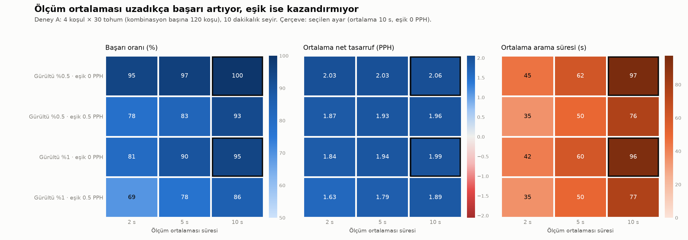
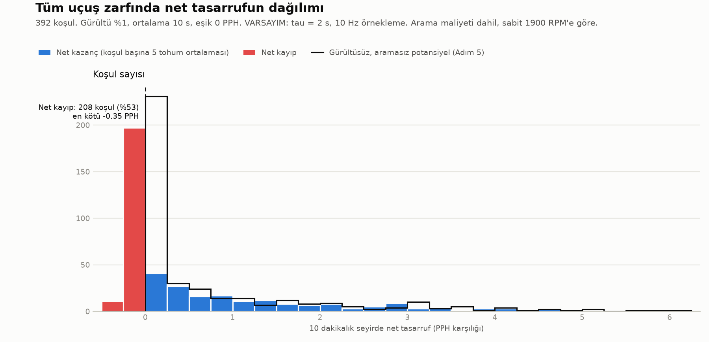
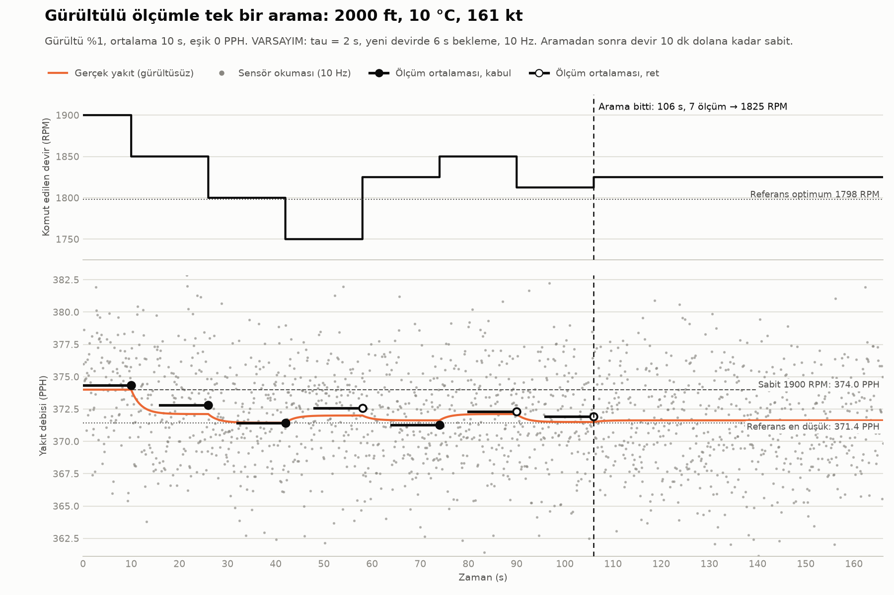

# Adım 6: Gerçekçi ölçümle net kazanç

Bu rapor, perturb & observe (P&O) algoritmasının ideal olmayan bir ölçüm sistemiyle (sensör
gürültüsü, motor gecikmesi, ölçüm ortalaması) çalıştırılmasından çıkan sonuçları özetler.
Kod: `olcum.py` (`GercekciOlcum`), `analiz/adim6.py`. Çıktılar: `sonuclar/adim6_*`.

## Ana soru ve kısa cevap

**Soru:** Devri arama sırasında oynatmanın maliyeti dahil, algoritma sabit 1900 RPM'e göre gerçekten
net kazanç sağlıyor mu?

**Cevap:** Ortalamada evet, ama zarfın her yerinde değil.

- Bütün zarfta ortalama net tasarruf **0,56 PPH (%0,17)**. Bu, gürültüsüz ve aramasız potansiyelin
  (Adım 5: 0,70 PPH) yaklaşık **%80'i**.
- Koşulların **%53'ünde küçük bir net kayıp** var. Kayıpların hepsi kazanılacak bir şeyin olmadığı ya
  da çok az olduğu koşullarda: 208 kayıplı koşulun 190'ında optimum zaten 1900'de, kalan 18'inde
  ideal tasarruf 0,5 PPH'nin altında.
- Kayıp ile kazanç arasında belirgin bir asimetri var. Kayıplar küçük (ortalama 0,10 PPH, en kötü
  0,35 PPH = %0,11), kazançlar 5,8 PPH'ye (%1,9) kadar çıkıyor. İdeal potansiyeli 0,5 PPH'yi aşan
  131 koşulun hiçbirinde net kayıp yok.

## 1. Ölçüm modeli ve varsayımlar

Algoritma kodu değişmedi; yine yalnızca `olc(devir)` fonksiyonunu çağırıyor. Ölçüm sistemi içeride
0,1 s adımlı bir zaman simülasyonu çalıştırıyor:

1. Devir değişince gerçek yakıt debisi, test dünyasının yeni devirdeki değerine **birinci derece
   gecikmeyle** yaklaşır.
2. Her yeni devirde ölçmeden önce **bekleme** yapılır (varsayılan 3·tau = 6 s, yaklaşık %95 oturma).
3. Sonra **ortalama_s** boyunca 10 Hz'de örnek alınır. Her örneğe gerçek değerin belli bir yüzdesi kadar
   standart sapmalı Gauss gürültüsü eklenir ve örneklerin ortalaması döndürülür.
4. Zaman, komut edilen devir, gerçek yakıt ve ölçülen yakıt zaman serisi olarak kaydedilir. Arama
   sırasında gerçekte yakılan yakıt bu kayıttan hesaplanır.

| Varsayım | Değer | Not |
|---|---|---|
| Motor zaman sabiti (tau) | 2 s | Gerçek motor verisi yok |
| Bekleme | 3·tau = 6 s | Her yeni devirde |
| Sensör gürültüsü | %0,5 ve %1 (std, gerçek değerin yüzdesi) | Beyaz Gauss, örnekler bağımsız; gerçek sensörlerde gürültü ilişkili olabilir, yani bu iyimser bir varsayım |
| Örnekleme | 10 Hz | |
| Seyir süresi | 10 dakika | Başlangıç 1900 RPM'de kararlı seyir |

Algoritmaya isteğe bağlı bir eşik parametresi (`esik_pph`, varsayılan 0) eklendi. Yeni ölçüm eskisinden
eşikten daha fazla düşükse "daha iyi" sayılıyor. Varsayılan değerde eski davranış birebir korunuyor.

## 2. Net kazancın tanımı

Her koşuda 10 dakikalık bir seyir simüle edildi. Algoritma 1900 RPM'den aramaya başlıyor, aramayı
bitirince bulduğu devre dönüyor ve süre bitene kadar orada kalıyor.

- **Net tasarruf:** Sabit 1900 RPM'de 10 dakikada yakılan yakıt eksi arama dahil gerçekte yakılan yakıt.
  PPH karşılığı ve yüzde olarak verildi.
- **Arama maliyeti:** Arama süresince sabit 1900'e göre fazladan yakılan yakıt. Negatifse arama
  sırasında zaten kazanç var.
- **Başabaş süresi:** Arama bittikten sonra, bulunan devirdeki kararlı kazancın arama maliyetini
  karşıladığı süre.
- **Başarı:** Bulunan devirdeki gerçek (gürültüsüz) yakıt, referans en düşük yakıttan en fazla 0,5 PPH
  fazla.

## 3. Deney A: parametre taraması

Koşullar: 2000 ft / −54 °C / 142 kt, 2000 ft / 10 °C / 161 kt, 6000 ft / 0 °C / 160 kt,
14000 ft / −20 °C / 160 kt. Her kombinasyon her koşulda 30 tohumla çalıştırıldı (kombinasyon başına
120 koşu). Aynı koşul ve tohum, bütün kombinasyonlarda aynı rastgele sayı tohumunu kullanıyor;
böylece karşılaştırma daha adil oluyor.

| Gürültü | Ortalama (s) | Eşik (PPH) | Başarı | Net (PPH) | Net (%) | Arama (s) | Ölçüm | Arama maliyeti (lb) |
|---|---:|---:|---:|---:|---:|---:|---:|---:|
| %0,5 | 2 | 0 | %95 | 2,03 | 0,58 | 45 | 6,4 | −0,028 |
| %0,5 | 2 | 0,5 | %78 | 1,87 | 0,54 | 35 | 5,1 | −0,022 |
| %0,5 | 5 | 0 | %97 | 2,03 | 0,59 | 62 | 6,1 | −0,038 |
| %0,5 | 5 | 0,5 | %83 | 1,93 | 0,56 | 50 | 5,1 | −0,032 |
| %0,5 | **10** | **0** | **%100** | **2,06** | **0,59** | 97 | 6,5 | −0,063 |
| %0,5 | 10 | 0,5 | %93 | 1,96 | 0,57 | 76 | 5,2 | −0,048 |
| %1 | 2 | 0 | %81 | 1,84 | 0,53 | 42 | 6,0 | −0,024 |
| %1 | 2 | 0,5 | %69 | 1,63 | 0,47 | 35 | 5,1 | −0,019 |
| %1 | 5 | 0 | %90 | 1,94 | 0,56 | 60 | 6,0 | −0,035 |
| %1 | 5 | 0,5 | %78 | 1,79 | 0,52 | 50 | 5,1 | −0,029 |
| %1 | **10** | **0** | **%95** | **1,99** | **0,57** | 96 | 6,4 | −0,057 |
| %1 | 10 | 0,5 | %86 | 1,89 | 0,55 | 77 | 5,2 | −0,046 |

Seçilen ayarla (%1 gürültü, 10 s, eşik 0) koşul bazında sonuçlar:

| Koşul | Başarı | Net (PPH) |
|---|---:|---:|
| 2000 ft, −54 °C, 142 kt | %90 | 5,38 |
| 2000 ft, 10 °C, 161 kt | %90 | 2,36 |
| 6000 ft, 0 °C, 160 kt | %100 | 0,28 |
| 14000 ft, −20 °C, 160 kt | %100 | −0,07 |

### Deney A'dan çıkanlar

- **Ölçüm ortalaması uzadıkça başarı artıyor.** Arama uzasa da net tasarruf düşmüyor, hafifçe artıyor.
  Bunun nedeni, optimum 1900'ün altındayken aramada denenen düşük devirlerin zaten daha az yakıt
  yakması. Bu yüzden arama maliyeti ortalamada negatif.
- **Eşik (0,5 PPH) hiçbir satırda işe yaramıyor.** Hem başarıyı hem net tasarrufu düşürüyor. Optimuma
  yaklaştıkça gerçek iyileşmeler 0,5 PPH'nin altına iniyor ve eşik bunları da reddediyor. Düz dipte
  yanlış bir adımı kabul etmenin bedeli ise küçük.
- **Optimumun 1900'de olduğu 14000 ft koşulunda her ayarda küçük bir net kayıp var**
  (−0,01 ile −0,12 PPH). Kazanılacak bir şey olmadığı için her keşif maliyet yazıyor.

### Seçim ve gerekçesi

**Seçilen ayar: ölçüm ortalaması 10 s, eşik 0 PPH.**

- Gürültü düzeyi tasarımcının seçebileceği bir ayar değil, bir ortam varsayımı. Izgarada doğrudan
  "en iyi"yi seçmek kendiliğinden %0,5 gürültüyü seçerdi. Bu yüzden seçim yalnızca ortalama süresi ve
  eşik üzerinden yapıldı.
- Ölçüt: Her gürültü düzeyinde, başarı oranı en yükseğe en fazla 5 puan yakın olan kombinasyonlar
  arasından ortalama net tasarrufu en büyük olan. İki gürültü düzeyinde de aynı ayar seçildi.
- Deney B kötümser gürültü düzeyiyle (%1) çalıştırıldı.
- Not: 10 s, denenen ızgaranın kenarı. Daha uzun ortalama süreleri denenmedi.

## 4. Deney B: bütün uçuş zarfı

Adım 5'teki 392 koşulun her biri 5 tohumla çalıştırıldı (1960 koşu). Ayarlar: %1 gürültü, 10 s ortalama,
eşik 0.

| Ölçüt | Değer |
|---|---|
| Başarı oranı (koşu) | %96,3 (fark ≤ 0,5 PPH); en büyük fark 3,50 PPH |
| Net tasarruf, ortalama | 0,56 PPH (%0,17) |
| Net tasarruf, medyan | −0,02 PPH (−%0,01) |
| Net tasarruf, en düşük / en yüksek | −0,35 PPH (−%0,11) / 5,78 PPH (%1,90) |
| İdeal potansiyel (Adım 5, gürültüsüz ve aramasız) | 0,70 PPH (%0,21) |
| Arama süresi | Ortalama 70 s, en fazla 186 s |
| Ölçüm sayısı | Ortalama 4,8; 50 ölçüm sınırına hiç ulaşılmadı |
| Arama maliyeti | Ortalama −0,011 lb (koşuların %56'sında pozitif) |
| Başabaş süresi | Maliyetli koşularda medyan 67 s; 1027 koşuda maliyet hiç karşılanmıyor (bulunan devir 1900'den iyi değil) |
| Net kayıp | Koşulların %53,1'i (208 koşul); kayıplı koşullarda ortalama −0,10 PPH |

Net tasarruf değerleri koşul başına 5 tohumun ortalamasıdır.

### Net kayıp nerede yoğunlaşıyor

| Gruplama | Grup | Kayıplı koşul | Ortalama net (PPH) |
|---|---|---:|---:|
| İdeal potansiyel | 0 (optimum ≈ 1900) | 190/190 (%100) | −0,10 |
| | 0–0,5 PPH | 18/71 (%25) | +0,11 |
| | 0,5–2 PPH | 0/79 (%0) | +0,92 |
| | > 2 PPH | 0/52 (%0) | +3,01 |
| Referans optimumun yeri | 1900 RPM (üst limit) | 177/177 (%100) | −0,11 |
| | Arada | 31/212 (%15) | +1,07 |
| | 1600 RPM (alt limit) | 0/3 (%0) | +3,30 |
| İrtifa | 2.000–6.000 ft | 33/128 (%26) | +1,20 |
| | 8.000–12.000 ft | 66/133 (%50) | +0,48 |
| | 14.000–18.000 ft | 79/97 (%81) | +0,03 |
| | 20.000–24.000 ft | 30/34 (%88) | −0,06 |

Optimumu "arada" olup kayıp veren 31 koşulun ideal potansiyeli de çok küçük (ortalama 0,02 PPH, en fazla
0,22 PPH).

## 5. Kaybın kaynağı

Optimumun zaten 1900'de olduğu (ideal potansiyeli sıfır) 950 koşu ayrıca incelendi:

- Koşuların **%71'i yine 1900'de bitiyor**. Kalanlar gürültü yüzünden daha düşük bir devirde kalıyor:
  206 koşu 1887,5'te, 40 koşu 1875'te, 30 koşu 1850'de.
- Ortalama net kayıp 0,104 PPH. Bunun yaklaşık **%42'si aramanın kendisinden** geliyor; 1850'yi denerken
  harcanan yakıt ortalama 0,0074 lb, yani 10 dakikaya göre 0,044 PPH.
- Kalan yaklaşık **%58'i yanlış devirde kalmaktan** geliyor. 1900'de bitmeyen koşularda kararlı kayıp
  ortalama 0,23 PPH.

**Başarısız koşular** (73 koşu, %3,7) ise ters yönde bir hata. Bunlarda gerçek bir kazanç varken gürültü
yüzünden 1900'ün yakınında takılıp kalınıyor (ortalama ideal potansiyel 1,54 PPH; 15'i tam 1900'de
kalıyor). En kötü örnek: 2000 ft / −54 °C / 147 kt, tohum 4. Algoritma 1900'de kaldı ve 3,5 PPH'lik
kazanç hiç alınamadı.

**Seyir süresine duyarlılık (simülasyon değil, tahmin):** Arama sonrası kararlı kazancın seyir boyunca
sürdüğü varsayılarak yapılan kaba bir ekstrapolasyona göre ortalama net tasarruf 10 dakikada 0,556,
30 dakikada 0,585, 60 dakikada 0,592 PPH. Net kayıp veren koşulların oranı ise üç sürede de %53,1'de
kalıyor. Yani seyri uzatmak arama maliyetini sulandırıyor ama yanlış devirde kalmanın kaybını
gidermiyor.

## 6. Tek bir koşunun zaman serisi

2000 ft / 10 °C / 161 kt, %1 gürültü, 10 s ortalama, eşik 0, tohum 0. Arama 106 s ve 7 ölçüm sürdü,
algoritma 1825 RPM'de durdu (referans optimum 1798 RPM). Grafikte ölçüm ortalamalarının gerçek yakıt
eğrisinin etrafında nasıl dağıldığı görülüyor. 74. saniyede 1825 RPM, gerçekte 1800'den kötü olduğu
halde (371,62'ye karşı 371,44 PPH) gürültü yüzünden daha iyi ölçüldü (371,27'ye karşı 371,43 PPH) ve
kabul edildi; algoritma da orada kaldı. Bulunan devirdeki gerçek yakıt yine de referanstan yalnızca
0,18 PPH fazla, yani başarı ölçütünün içinde. Bu, düz dipte gürültünün yön kararlarını bozduğunu ama
bedelinin küçük kaldığını gösteren tipik bir örnek.

## 7. Yorum

1. **Algoritma gerçekçi ölçümde de çoğunlukla doğru yere gidiyor** (%96 başarı). Sabit 1900'e göre
   potansiyelin yaklaşık %80'ini net olarak alıyor.
2. **Net kayıp yaygın ama küçük.** Kayıp, kazanılacak bir şeyin olmadığı yerlerde ortaya çıkıyor; büyük
   ölçüde yüksek irtifada. Bu koşullarda her keşif ve her gürültü hatası doğrudan maliyete dönüşüyor.
3. **Bu test dünyasında P&O sabit çizelgeyi geçemiyor.** Test dünyası tablonun kendisi olduğu için,
   aynı tablodan çıkarılan bir sabit çizelge ideal potansiyeli (0,70 PPH) aramasız ve kayıpsız verir.
   P&O ise 0,56 PPH veriyor. P&O'nun gerçek avantajı ancak uçak tablodan saptığında ortaya çıkabilir.
   Bu da önceki raporda önerilen "sapmalı dünya" deneyini daha önemli hale getiriyor.

## 8. Olası iyileştirmeler (uygulanmadı)

Sonuçları güzelleştirmek için parametrelerle oynanmadı. Kayıpları azaltabilecek fikirler:

- **1900'e dönüş kontrolü:** Arama bittiğinde bulunan devir 1900'den belirgin şekilde iyi değilse
  1900'e geri dönmek. Optimumu 1900'de olan koşullarda kaybın %58'ini oluşturan yanlış devirde kalmayı
  hedefliyor.
- **Sabit çizelgeyi ön bilgi olarak kullanmak:** `sonuclar/sabit_cizelge.csv` bir koşulda optimumun
  1900'de olduğunu söylüyorsa aramayı hiç başlatmamak ya da daha dar bir aralıkta aramak.
- **Daha uzun ölçüm ortalaması:** 10 s ızgaranın kenarıydı. Daha uzun süreler denenebilir.

## 9. Sınırlamalar

- tau, gürültü düzeyi, gürültünün beyaz ve bağımsız olması ve 10 Hz örnekleme **varsayım**. Gerçek
  sensör gürültüsü ilişkiliyse (yavaş kayma gibi), ortalama almanın faydası burada görülenden az olur.
- Uçuş koşulu 10 dakika boyunca sabit kabul edildi. Gerçekte irtifa, sıcaklık, ağırlık ve türbülans
  değişir, bu da ölçümü ayrıca bozar.
- Test dünyası "aynı hız, farklı devir" durumunu varsayıyor; yani devir değişince gücün hızı sabit
  tutacak şekilde ayarlandığı kabul ediliyor. Bu ayarın dinamiği motor gecikmesinin içinde kabaca
  temsil ediliyor.
- Zarf ortalamalarında her koşul eşit sayıldı; hangi koşulda ne kadar uçulduğu hesaba katılmadı.
- Deney B'de koşul başına 5 tohum var. Tek tek koşulların ortalaması istatistiksel olarak gürültülü,
  zarf genelindeki oranlar daha güvenilir.
- 5. bölümdeki ayrıştırma ve seyir süresi tahmini `sonuclar/adim6_zarf_kosular.csv`'den ayrıca
  hesaplandı; bu hesabın script'i henüz repoda yok. Yöntem: ideal potansiyeli 0,005 PPH'nin altındaki
  koşular seçildi. Arama maliyeti ile bulunan devirdeki kararlı kazanç ayrı ayrı ortalandı. Seyir
  süresi tahmini için net = (−arama maliyeti + kararlı kazanç × (T − arama süresi)) / T formülü
  kullanıldı.

## 10. Testler ve yeniden üretim

- `python -m pytest`: 21 test geçti.
  - Gürültü 0 ve çok küçük tau ile bütün zarfta Adım 5 sonuçları birebir çıkıyor.
  - Aynı tohumla iki koşu birebir aynı sonucu veriyor.
  - Motor gecikmesi analitik çözümle eşleşiyor.
  - Gürültü düzeyi, eşik davranışı ve eski testlerin hepsi doğrulandı.
- `python analiz/adim6.py`: Deney A ve B'yi çalıştırır (4 çekirdekte yaklaşık 50 s). Konsola özeti
  yazar, `sonuclar/` klasörüne şunları kaydeder:
  - `adim6_parametre_taramasi.csv`: Deney A, koşu başına
  - `adim6_zarf.csv`: Deney B, koşul başına
  - `adim6_zarf_kosular.csv`: Deney B, koşu başına
  - Üç grafik
